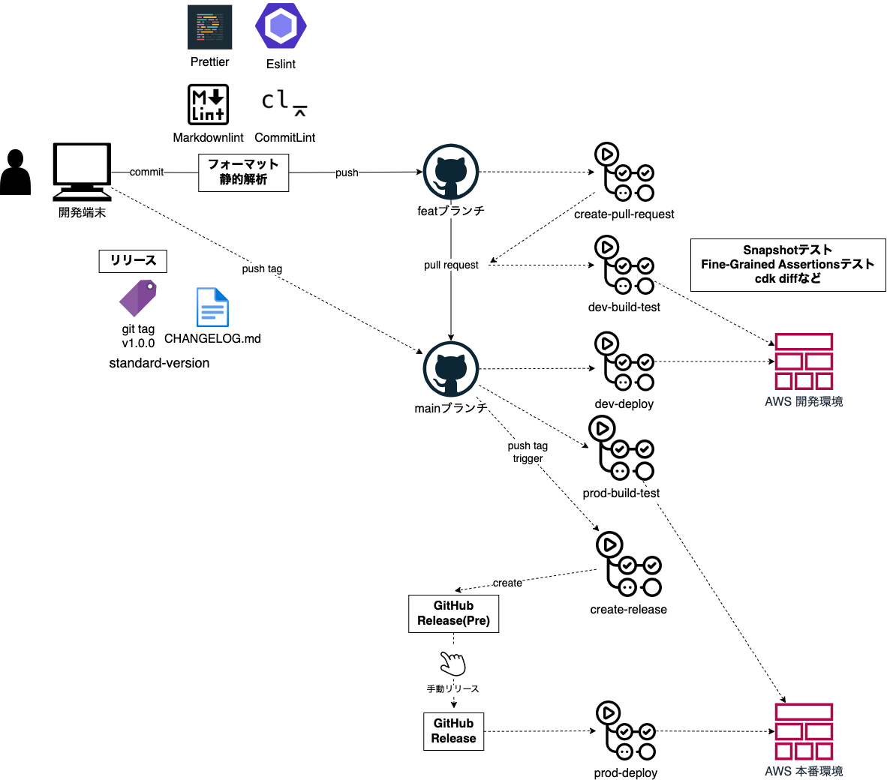

# AWS CDK プロジェクトテンプレート　 <!-- omit in toc -->

このプロジェクトはGitHub管理を想定したAWS CDKプロジェクトのテンプレートです  
静的解析、テスト、GitHub ActionsによるCICDなどを含みます

## 目次 <!-- omit in toc -->

- [CICD](#cicd)
  - [構成](#構成)
  - [静的解析](#静的解析)
  - [ビルドとテスト](#ビルドとテスト)
  - [CDK Deploy](#cdk-deploy)
  - [リリース](#リリース)
  - [packageの自動更新](#packageの自動更新)
- [設定ファイル一覧](#設定ファイル一覧)
- [ローカル開発環境構築](#ローカル開発環境構築)
  - [リポジトリの作成と設定](#リポジトリの作成と設定)
  - [デプロイ先AWSアカウントIDを環境変数に登録](#デプロイ先awsアカウントidを環境変数に登録)
  - [DevContainers設定](#devcontainers設定)
  - [パッケージインストール](#パッケージインストール)
- [GitHub Actions設定](#github-actions設定)
  - [OIDCでIAM Roleを使ってAWSにアクセスするための設定](#oidcでiam-roleを使ってawsにアクセスするための設定)
  - [GitHub Environment設定](#github-environment設定)
  - [Github Appsの設定](#github-appsの設定)

## CICD

### 構成



### 静的解析

commit時にhuskyを使用して以下を実行

- Prettierによるフォーマッティング
- ESLintによるTypescriptファイルのリント
- Markdownlintによるmarkdownファイルのリント
- CommitLintによるコミットメッセージのリント

### ビルドとテスト

- depcheckによるパッケージの依存関係チェック
- Prettierによるフォーマットチェック
- ESLintによるTypescriptファイルのリント
- cdk diffによる現在のStackとの差分確認
- Snapshotテスト、Fine-Grained Assertionsテスト

### CDK Deploy

- aws-actions/configure-aws-credentialsでIAM Roleを使用し、一時認証情報でAWS環境へのデプロイを実施
- サンプルコードはStageを使用、デプロイ先環境ごとにスタックをまとめている

### リリース

- ローカルで以下のnpm script実行
- CHANGELOG.mdが自動で更新され、Gitタグが付与、それらがリモートブランチに自動でpushされる
- tag pushをトリガーにGitHub ReleaseがPre-Release状態で作成される
- Pre-Releaseを手動でReleaseすることで、prd環境へのデプロイが実行される

```bash
npm run release
```

### packageの自動更新

- dependabotでnpm packageの更新を自動検知、プルリクエストを作成
- GitHub AppのMergifyでプルリクを自動マージ


[手動更新する場合](./docs/npmUpdate.md)

## 設定ファイル一覧

| ファイル名                       | 内容                                                                                                                                          | リンク                                                                                                                                                   |
| -------------------------------- | --------------------------------------------------------------------------------------------------------------------------------------------- | -------------------------------------------------------------------------------------------------------------------------------------------------------- |
| tsconfig.json                    | Typescript設定ファイル                                                                                                                        | https://www.typescriptlang.org/ja/tsconfig/                                                                                                              |
| cdk.json                         | AWS CDKの設定ファイル                                                                                                                         |                                                                                                                                                          |
| config.ts                        | 独自に作成したAWS CDKコードで使用する<br/>定数設定ファイル                                                                                    |                                                                                                                                                          |
| .editorconfig                    | コードエディタ間でファイルフォーマットを<br/>一貫させるための設定ファイル                                                                     | https://editorconfig.org/                                                                                                                                |
| .versionrc                       | ローカルブランチで動作する<br/>バージョニングツールstandard-version<br/>の設定ファイル                                                        | https://github.com/conventional-changelog/conventional-changelog-config-spec/blob/master/versions/2.2.0/README.md                                        |
| CHANGELOG.md                     | standard-versionによってgit logをもとに<br/>自動生成される変更履歴                                                                            |                                                                                                                                                          |
| jest.config.js                   | テストツールjestの設定ファイル                                                                                                                | https://jestjs.io/ja/docs/configuration                                                                                                                  |
| .vscode/extensions.json          | VSCodeのおすすめ拡張機能リスト                                                                                                                | https://code.visualstudio.com/docs/editor/extension-marketplace#_workspace-recommended-extensions                                                        |
| .vscode/settings.json            | VSCodeの設定ファイル                                                                                                                          | https://code.visualstudio.com/docs/getstarted/settings                                                                                                   |
| .prettierrc.js                   | コードを自動フォーマットするPrettier<br/>の設定ファイル                                                                                       | https://prettier.io/docs/en/configuration.html                                                                                                           |
| .prettierignore                  | Prettierの対象外とするファイルを指定する                                                                                                      | https://prettier.io/docs/en/ignore.html                                                                                                                  |
| .eslintrc.js                     | Typescriptコードの静的解析に利用するESLint<br/>の設定ファイル                                                                                 | https://eslint.org/docs/latest/use/configure/configuration-files                                                                                         |
| .markdownlint-cli2.jsonc         | Markdownファイルの静的解析に利用する<br/>markdownlint-cli2の設定ファイル                                                                      | https://github.com/DavidAnson/markdownlint-cli2                                                                                                          |
| .depcheckrc.yml                  | 未使用のパッケージやpackage.jsonの記載確認<br/>するdepcheckの設定ファイル                                                                     | https://www.npmjs.com/package/depcheck                                                                                                                   |
| .github/.mergify.yml             | 条件に基づいてプルリクの自動マージを行う<br/>GitHub AppsのMergiftの設定ファイル                                                               | https://docs.mergify.com/configuration/file-format/                                                                                                      |
| .github/PULL_REQUEST_TEMPLATE.md | プルリクのテンプレートファイル<br/>自動で適用される                                                                                           | https://docs.github.com/ja/communities/using-templates-to-encourage-useful-issues-and-pull-requests/creating-a-pull-request-template-for-your-repository |
| .github/dependabot.yml           | パッケージの更新を自動で確認し、<br/>アラートをあげたり、プルリクを作成する<br/>Dependabotの設定ファイル<br/>設定ファイルを置くだけで動作する | https://docs.github.com/ja/code-security/dependabot/dependabot-version-updates/configuration-options-for-the-dependabot.yml-file                         |
| .devcontainer/devcontainer.json  | VSCodeのコンテナ開発環境支援ツールである<br/>devcontainerの設定ファイル                                                                       | https://code.visualstudio.com/docs/devcontainers/containers#_create-a-devcontainerjson-file                                                              |

## ローカル開発環境構築

### リポジトリの作成と設定

任意のリポジトリ名でディレクトリを作成

```bash
mkdir [リポジトリ名]
cd [リポジトリ名]
```

cdk-project-templateのzipをダウンロードして展開  
zipの中身を作成したディレクトリの配下に入れる

https://github.com/kasiopeiya/cdk-project-template/releases/latest/download/cdk-project-template.zip

```bash
~/dev/aws-cdk/hoge $ ls
CHANGELOG.md            bin                     config.ts               lib                     package.json            test
README.md               cdk.json                jest.config.js          package-lock.json       resources               tsconfig.json
```

### デプロイ先AWSアカウントIDを環境変数に登録

macの場合

```bash
echo "export DEV_ACCOUNT_ID=***" >> ~/.zshrc
echo "export PROD_ACCOUNT_ID=***" >> ~/.zshrc
source ~/.zshrc
```

### DevContainers設定

VSCode拡張機能Dev Containersをインストールし、Remote Explorerでコンテナ起動

### パッケージインストール

- package-lock.jsonがあるディレクトリで以下実行
- コンテナ環境で実行しないとesbuildでエラーになるため注意

```bash
npm ci
```

## GitHub Actions設定

### OIDCでIAM Roleを使ってAWSにアクセスするための設定

参考リンクをもとに以下を作成

- IDプロバイダーの作成
- デプロイ用IAM Role作成

参考  
https://qiita.com/yh1224/items/2a8223201b48a5c41e7a  
https://blog.serverworks.co.jp/github-actions-iam-role

### GitHub Environment設定

SecretsにOIDC RoleのArnを、Variablesに環境名を登録する


### Github Appsの設定

- Set up a planで以下を対象リポジトリに導入する
- packageの自動更新で使用する

- Mergify  
  https://github.com/marketplace/mergify

## GitHub Actions設定

### OIDCロール作成

```bash
roleName="cdk-deploy-role-ap-northeast-1"
region="ap-northeast-1"
accountId=""
# ex. kasiopeiya/*:*
repositoryPath=""

aws iam create-role \
    --role-name $roleName \
    --assume-role-policy-document '{
        "Version": "2012-10-17",
        "Statement": [
            {
                "Effect": "Allow",
                "Principal": {
                    "Federated": "arn:aws:iam::${accountId}:oidc-provider/token.actions.githubusercontent.com"
                },
                "Action": "sts:AssumeRoleWithWebIdentity",
                "Condition": {
                    "StringEquals": {
                        "token.actions.githubusercontent.com:aud": "sts.amazonaws.com"
                    },
                    "StringLike": {
                        "token.actions.githubusercontent.com:sub": "repo:${repositoryPath}"
                    }
                }
            }
        ]
    }'

aws iam attach-role-policy \
    --role-name $roleName \
    --policy-arn "arn:aws:iam:aws:policy/ReadOnlyAccess"

aws iam put-role-policy \
    --role-name $roleName \
    --policy-name cdk-deploy-policy \
    --policy-document '{
        "Version": "2012-10-17",
        "Statement": [
            {
                "Sid": "AssumeCDKRoles",
                "Effect": "Allow",
                "Action": "sts:AssumeRole",
                "Resource": "*",
                "Condition": {
                    "ForAnyValue:StringEquals": {
                            "iam:ResourceTag/aws-cdk:bootstrap-role": [
                            "image-publishing",
                            "file-publishing",
                            "deploy",
                            "lookup"
                        ]
                    }
                }
            },
            {
                "Sid": "testApiGateways",
                "Effect": "Allow",
                "Action": [
                    "apigateway:GET",
                    "apigateway:POST"
                ]
                "Resource": "*"
            },
            {
                "Sid": "sanityTest",
                "Effect": "Allow",
                "Action": [
                    "codebuild:StartBuild",
                    "codebuild:BatchGetBuilds",
                    "codebuild:BatchGetProjects"
                ]
                "Resource": "arn:aws:codebuild:${region}:${accountId}:project/*"
            }
        ]
    }'
```
